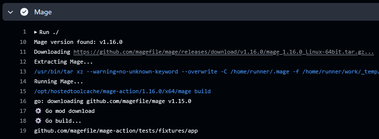

<p align="center">
  
  <h3 align="center">Mage Action</h3>
  <p align="center"><a href="https://github.com/features/actions">GitHub Action</a> for Mage</p>
  <p align="center">
    <a href="https://github.com/magefile/mage-action/releases/latest"></a>
    <a href="https://github.com/marketplace/actions/mage-action"></a>
    <a href="https://github.com/magefile/mage-action/actions?workflow=test"></a>
    <a href="https://codecov.io/gh/magefile/mage-action"></a>
    <a href="https://github.com/sponsors/crazy-max"></a>
  </p>
</p>

___



* [Usage](#usage)
* [Customizing](#customizing)
  * [inputs](#inputs)
* [Keep up-to-date with GitHub Dependabot](#keep-up-to-date-with-github-dependabot)
* [License](#license)

## Usage

```yaml
name: mage

on:
  pull_request:
  push:

jobs:
  mage:
    runs-on: ubuntu-latest
    steps:
      -
        name: Checkout
        uses: actions/checkout@v3
      -
        name: Set up Go
        uses: actions/setup-go@v3
        with:
          go-version: 1.14
      -
        name: Run Mage
        uses: magefile/mage-action@v1
        with:
          version: latest
          args: build
```

> For detailed instructions please follow GitHub Actions [workflow syntax](https://help.github.com/en/articles/workflow-syntax-for-github-actions#About-yaml-syntax-for-workflows).

## Customizing

### inputs

Following inputs can be used as `step.with` keys

| Name          | Type    | Default   | Description                      |
|---------------|---------|-----------|----------------------------------|
| `version`     | String  | `latest`  | Mage version. Example: `v1.9.0`  |
| `args`        | String  |           | Arguments to pass to Mage        |
| `workdir`     | String  | `.`       | Working directory (below repository root) |

## Keep up-to-date with GitHub Dependabot

Since [Dependabot](https://docs.github.com/en/github/administering-a-repository/keeping-your-actions-up-to-date-with-github-dependabot)
has [native GitHub Actions support](https://docs.github.com/en/github/administering-a-repository/configuration-options-for-dependency-updates#package-ecosystem),
to enable it on your GitHub repo all you need to do is add the `.github/dependabot.yml` file:

```yaml
version: 2
updates:
  # Maintain dependencies for GitHub Actions
  - package-ecosystem: "github-actions"
    directory: "/"
    schedule:
      interval: "daily"
```

## License

MIT. See `LICENSE` for more details.
